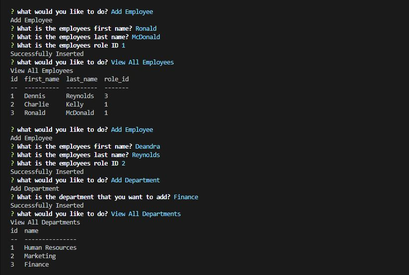
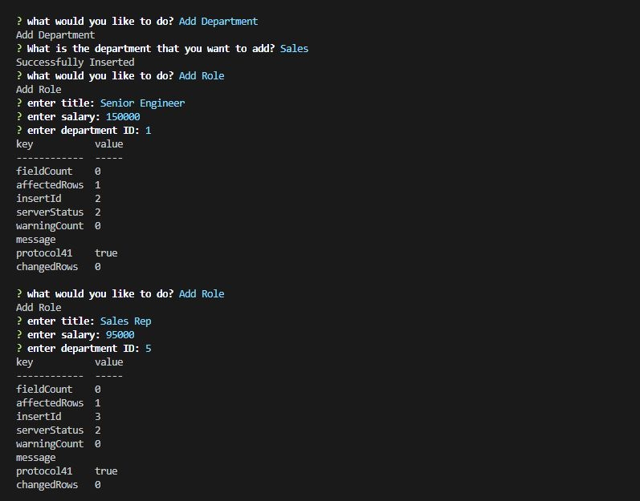

# Employee Tracker

## Table of Contents

- [Description](#description)
- [Demo](#demo)
- [Presequisites](#prerequisites)
- [Author](#author)
- [Installation](#installation)
- [Technologies Used](#technologies-used)
- [License](#license)

---
## Description

This command-line application will help manage departments, roles, and employees within your company. It will help keep your organize employee's roles, salary, and department standing. 

---

## Demo

---

## Prerequisites

* Git Terminal
* Node
* MySql and MySQL Workbench
* NPM Packages:
    * inquirer, mysql, console-table

---     

## Author

Jeanette Hernandez

--- 

## Installation

1. Download zip file: ` git@github.com:jeanhern81/Employee_Tracker.git `
2. Unzip into  your local directory
3. Install: 
    * npm install inquirer
    * npm install mysql
    * npm install console-table
4. Use your Git terminal to run index.js

---

## Technologies Used:

* JavaScript
* NodeJS
* Node Packages: 
    * Inquirer, MySql, Console-Table

### ISC License:

Copyright (c) [2020], [Jeanette Hernandez]

Permission to use, copy, modify, and/or distribute this software for any
purpose with or without fee is hereby granted, provided that the above
copyright notice and this permission notice appear in all copies.

THE SOFTWARE IS PROVIDED "AS IS" AND THE AUTHOR DISCLAIMS ALL WARRANTIES
WITH REGARD TO THIS SOFTWARE INCLUDING ALL IMPLIED WARRANTIES OF
MERCHANTABILITY AND FITNESS. IN NO EVENT SHALL THE AUTHOR BE LIABLE FOR
ANY SPECIAL, DIRECT, INDIRECT, OR CONSEQUENTIAL DAMAGES OR ANY DAMAGES
WHATSOEVER RESULTING FROM LOSS OF USE, DATA OR PROFITS, WHETHER IN AN
ACTION OF CONTRACT, NEGLIGENCE OR OTHER TORTIOUS ACTION, ARISING OUT OF
OR IN CONNECTION WITH THE USE OR PERFORMANCE OF THIS SOFTWARE.

